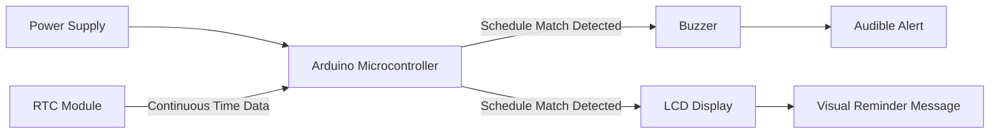

# 🗺️ Block Diagram: Smart Medicine Reminder System

This document describes the block-level architecture of the Smart Medicine Reminder System, showing the flow from time tracking to alert generation.

---

## 1. 🔌 High-Level Block Diagram

---

## 2. 🧩 Block Descriptions

| Block | Function |
|---|---|
| Power Supply | Provides power to the Arduino and connected peripherals |
| Arduino Microcontroller | Central processing unit; runs schedule-comparison logic and controls outputs |
| RTC Module | Continuously supplies accurate real-world time to the Arduino |
| Buzzer | Generates an audible alert when a scheduled dose time is reached |
| LCD Display | Displays the medication reminder message to the user |

---

## 3. ➡️ Signal Flow Summary

1. **Power Supply → Arduino:** Supplies operating power to the microcontroller and peripherals
2. **RTC Module → Arduino:** Continuously provides current real-world time
3. **Arduino (internal logic):** Compares current time against pre-set medication schedule
4. **Arduino → Buzzer:** On schedule match, triggers an audible alert
5. **Arduino → LCD Display:** On schedule match, displays the reminder message simultaneously

---

## 4. 📝 Notes on Diagram Rendering

This diagram uses [Mermaid syntax](https://mermaid.js.org/), which renders automatically as a visual flowchart when viewed on GitHub (in README files, issues, and markdown previews). No external image file or diagramming tool is required — the diagram is defined entirely in text form within this markdown file.
